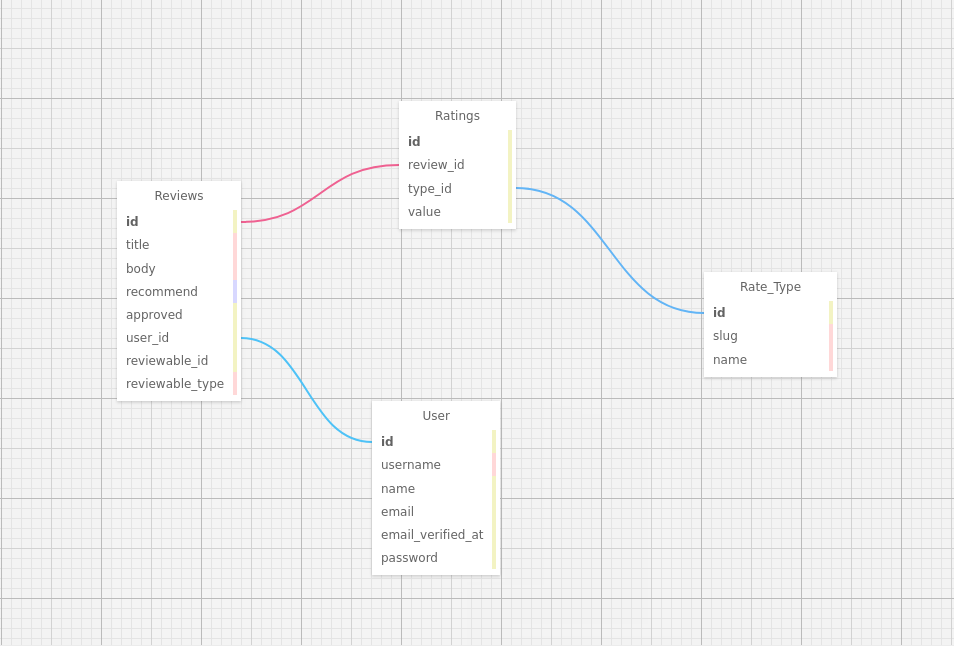

# R8: Reviews, Ratings and Recommendations

Laravel has always been missing a package like this, that supports dynamic rating with multiple Rating Types (ex. Like in Amazon or any e-commerce platform, Quality Rating, Customer Service Experience Ratings, etc.) with Integrated Reviews and Recommend Functionality.

The main Ideology behind this package is to make it easily adaptable for everyone's use case.

Reviews & Ratings system for Laravel 7. You can rate any of your models.

-   Custom Rating Types (ex: Product Quality, Delivery Speed, Pricing, etc.) without any limitations.
-   Display Overall and Average Ratings
-   Method Chaining
-   You can set whether the model being rated is recommended.

# Installation

First, pull in the package through Composer.

```
composer require secrethash/r8
```

**NOTE: The `dev-master` is _UNDER HEAVY DEVELOPMENT_**

You will need to publish and run the migrations.

```
php artisan vendor:publish --provider="Secrethash\R8\R8ServiceProvider" --tag="migrations"
```

Run the migrations

```
php artisan migrate
```

---

## Setup

Setup the model that will be reviewed, rated & recommended.

```php
<?php

namespace App;

use Secrethash\R8\Contracts\R8;
use Secrethash\R8\Traits\R8Trait;
use Illuminate\Database\Eloquent\Model;

class Post extends Model implements R8
{
    
    use R8Trait;

}
```

# Usage

Things will be kept simple. But to understand usage, you must understand the methodology behind it.

#### Methodology

The Methodology used is:
| Utility | Relation | With |
|---------|------------|-----------|
|Review | HasMany | Ratings |
|Ratings | BelongsTo |RatingTypes|
|Recommend|is a part of| Reviews |

## Fetch

Taking Simple Laravel Examples.

`App\Http\Controllers\PostController.php`

```php
	public function show($id)
	{
		$post = Post::find($id);

		return view('post.show')->with('post', $post);
	}

```

### Reviews & Recommend

`resources/views/post/show.blade.php`

```php
@foreach($post->reviews as $review)

	<h2> {{ $review->title }} </h2>
	<p> {{ $review->body }} </p>
	<span> Recommended: {{ $review->recommend }} </span>
	<span> By: {{ $review->author->name }} </span>

@endforeach
```

### Ratings

**NOTE:** A Review must be created first to Create and link One or Many ratings with it.

`resources/views/post/show.blade.php`

```php
@foreach($post->reviews as $review)

	<h2> {{ $review->title }} </h2>
	<p> {{ $review->body }} </p>
	<span> Recommended: {{ $review->recommend }} </span>
	<span> By: {{ $review->author->name }} </span>

	@foreach ($review->ratings as $rating)
		{{ $rating->type->name }}
		{{ $rating->value }}
	@endforeach

@endforeach
```

## Create

### Reviews

`App\Http\Controllers\ReviewController.php`

```php
<?php

namespace App\Http\Controllers;

use App\Post;

class ReviewController {

    /**
     * Store a newly created resource in storage.
     *
	 * @param $id
     * @param  \Illuminate\Http\Request  $request
     * @return \Illuminate\Http\Response
     */
	public function store($id, Request $request)
	{
		$post = Post::find($id);

		// Create Review
		$review = $post->reviews()->create([
            		'title' => 'One More Bad Sample Review',
            		'body' => 'This is a another new sample review. This one has 4 Type Reviews.',
            		'recommend' => 'No',
		]);

		// Associate Author User ID
        $review->author()->associate(auth()->user()->id);

	}
}
```

### Rating

> **Assumption:** A Rating Type has already been created with `'slug' => 'customer-service'`.

`App\Http\Controllers\ReviewController.php`

```php
<?php

namespace App\Http\Controllers;

use App\Post;
use Secrethash\R8\Models\RateType;

class ReviewController {

    /**
     * Store a newly created resource in storage.
     *
	 * @param $id
     * @param  \Illuminate\Http\Request  $request
     * @return \Illuminate\Http\Response
     */
	public function store($id, Request $request)
	{
		$post = Post::find($id);

		// Getting the ID
		$type = RateType::where('slug', 'customer-service')->first();

		// Create Review
		$review = $post->reviews()->create([
            		'title' => 'One More Bad Sample Review',
            		'body' => 'This is a another new sample review. This one has 4 Type Reviews.',
            		'recommend' => 'Yes', // Enum: accepts 'Yes' or 'No'
		]);

		// Associate Author User ID
		$review->author()->associate(auth()->user()->id);

		// Creating Rating
		$rating = $review->ratings()->create([
			'value' => 5
		]);

		// Associate Rating Type ID
		$rating->type()->associate($type->id);

		// Saving Everything
		$review->save();
		$rating->save();

	}
}
```

## RateTypes

Similarly, `Secrethash\R8\Models\RateType` can be used to create Rating Types like _Product Quality_, _Customer Service_, _Delivery_, etc.

| Fillable | Description   |
| -------- | ------------- |
| slug     | Sluggish Name |
| name     | Full Name     |

## Other Operations

To keep things simple, Operations like Counting Reviews and Ratings are done through well defined relations, the Laravel Way.

### Counting

#### Reviews

```php
<?php

namespace App\Http\Controllers;

use App\Post;

class ReviewController {

	public function show($id)
	{
		$post = Post::find($id);

		$reviews = $post->reviews->count();

		$approved = $post->reviews
				 ->where('approved', 1)
				 ->count();

		return view('post.show')->with(['post' => $post, 'reviews' => $reviews, 'approved' => $approved]);
	}
}
```

#### Ratings

Assuming the counting will be performed directly in the `blade.php` file.

`resources/views/post/show.blade.php`

```php
@foreach($post->reviews as $review)
	...
	Total Ratings: {{ $review->ratings->count() }}
	...
@endforeach
```

### Average

#### Ratings

Laravel manages collections in a smart way. And as we know that "All multi-result sets returned by Eloquent are instances of the `Illuminate\Database\Eloquent\Collection` object" <sup>[Laravel Docs][1]</sup>
All you need to do is pass in the name of the table (here `value`) in the `average()` collection helper method.

`resources/views/post/show.blade.php`

```php
@foreach($post->reviews as $review)
	...
	Average Ratings: {{ $review->ratings->average('value') }}
	...
@endforeach
```

## Contributions

Contributions are welcomed and appreciated. Feel free to create a Pull Request or an Issue.

### Database Structure

As this package is still under development, the database structure might change in future. The structure ER Diagram is provided as [XML File](./db.rd.xml) and also as an Image File.


## License

This project is Licensed under MIT. See the [License File](./LICENSE) for more information.

### Note

> This repository has been forked from [codebyray/laravel-review-rateable](https://github.com/codebyray/laravel-review-rateable.git)

It was forked initially as a head-start and a lot has been changed since then. The whole concept and methodology has been changed.

Please note that the original code does not matches the code from this repository as a lot has been changed.

[1]: https://laravel.com/docs/7.x/eloquent-collections "Laravel Docs for Eloquent Collections"
